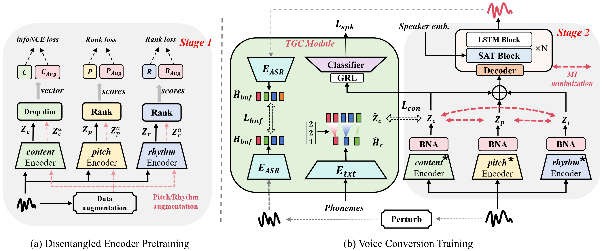
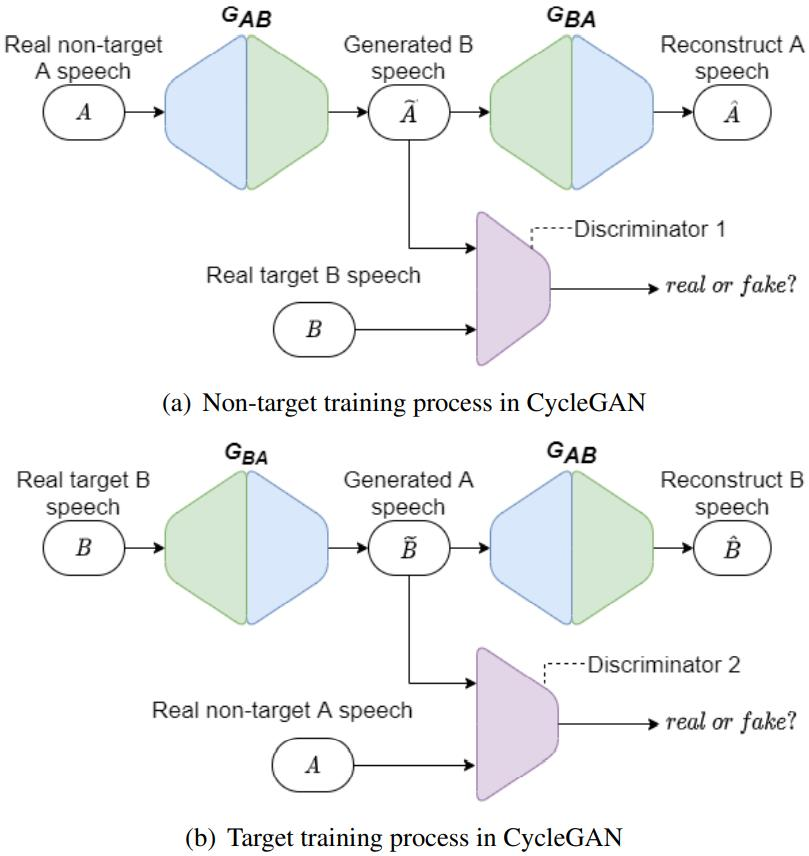
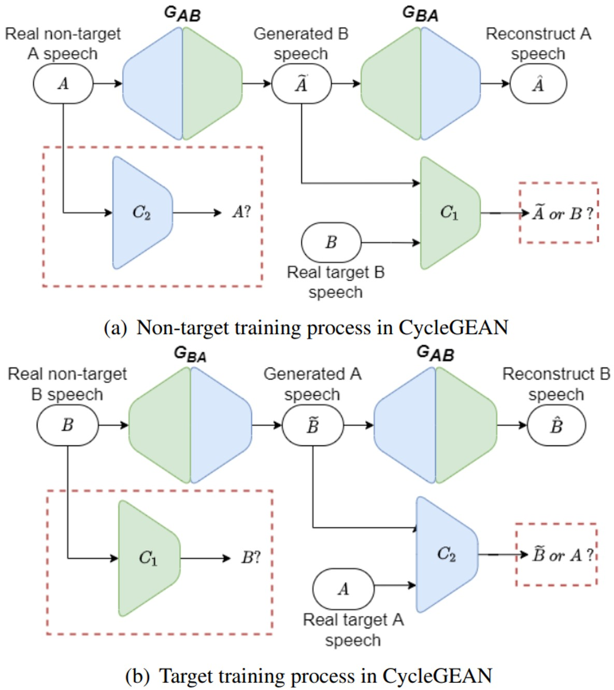

In this post, we show the demo of EAD-VC.

## Model Architecture

    

       

Figure.1 The architecture of the EAD-VC.
 

<!-- 
Figure.1 The architecture of the EAD-VC.
 -->

<!-- ### General Digestive Metabolic Network

Figure.1 The architecture of the CycleGAN-VC.

### Functional Digestive Metabolic Network

Figure.2 The architecture of the CycleGEAN.
 -->

## Experiment

### Results
In order to evaluate and show the performance of our model, we list the four Tables to respective show the four Female-to-Male conversion (F2M), Male-to-Female conversion (M2F), One-Shot voice conversion (Timbre Conversion and Not Only Timbre Conversion). 

&nbsp;
 

<table>
	<CAPTION>Table.1 The comparision between the EAD-VC and other models on F2M. </CAPTION>
    <tr>
        <th> ID </th>
	<th> Ground Truth</th>
        <th> Adain-VC </th>
	<th> SpeechFlow </th>
        <th> Liu et al. </th>
	<th> VQMIVC </th>
	<th> EAD-VC </th>
    </tr>
    <tr>
        <th> Sample 1 </th>
	<th> <audio controls id="player" onplay="pauseOthers(this);"><source src="assets/audios/F2M/002/GT_002.wav" type="audio/mpeg"></audio> </th>
        <th> <audio controls id="player" onplay="pauseOthers(this);"><source src="assets/audios/F2M/002/Adain_VC.wav" type="audio/mpeg"></audio> </th>
        <th> <audio controls id="player" onplay="pauseOthers(this);"><source src="assets/audios/F2M/002/SpeechFlow.wav" type="audio/mpeg"></audio> </th>
        <th> <audio controls id="player" onplay="pauseOthers(this);"><source src="assets/audios/F2M/002/Liu_base.wav" type="audio/mpeg"></audio> </th>
	<th> <audio controls id="player" onplay="pauseOthers(this);"><source src="assets/audios/F2M/002/VQMIVC.wav" type="audio/mpeg"></audio> </th>
	<th> <audio controls id="player" onplay="pauseOthers(this);"><source src="assets/audios/F2M/002/EAD_VC.wav" type="audio/mpeg"></audio> </th>
    </tr>
	
	<tr>
        <th> Sample 2 </th>
	<th> <audio controls id="player" onplay="pauseOthers(this);"><source src="assets/audios/F2M/004/GT_004.wav" type="audio/mpeg"></audio> </th>
        <th> <audio controls id="player" onplay="pauseOthers(this);"><source src="assets/audios/F2M/004/Adain_VC.wav" type="audio/mpeg"></audio> </th>
        <th> <audio controls id="player" onplay="pauseOthers(this);"><source src="assets/audios/F2M/004/SpeechFlow.wav" type="audio/mpeg"></audio> </th>
        <th> <audio controls id="player" onplay="pauseOthers(this);"><source src="assets/audios/F2M/004/Liu_base.wav" type="audio/mpeg"></audio> </th>
	<th> <audio controls id="player" onplay="pauseOthers(this);"><source src="assets/audios/F2M/004/VQMIVC.wav" type="audio/mpeg"></audio> </th>
 	<th> <audio controls id="player" onplay="pauseOthers(this);"><source src="assets/audios/F2M/004/EAD_VC.wav" type="audio/mpeg"></audio> </th>
    </tr>
	
	
	<tr>
        <th> Sample 3 </th>
	<th> <audio controls id="player" onplay="pauseOthers(this);"><source src="assets/audios/F2M/010/GT_010.wav" type="audio/mpeg"></audio> </th>
        <th> <audio controls id="player" onplay="pauseOthers(this);"><source src="assets/audios/F2M/010/Adain_VC.wav" type="audio/mpeg"></audio> </th>
        <th> <audio controls id="player" onplay="pauseOthers(this);"><source src="assets/audios/F2M/010/SpeechFlow.wav" type="audio/mpeg"></audio> </th>
        <th> <audio controls id="player" onplay="pauseOthers(this);"><source src="assets/audios/F2M/010/Liu_base.wav" type="audio/mpeg"></audio> </th>
	<th> <audio controls id="player" onplay="pauseOthers(this);"><source src="assets/audios/F2M/010/VQMIVC.wav" type="audio/mpeg"></audio> </th>
 	<th> <audio controls id="player" onplay="pauseOthers(this);"><source src="assets/audios/F2M/010/EAD_VC.wav" type="audio/mpeg"></audio> </th>
    </tr>
	
</table>

&nbsp;
 

<table>
	<CAPTION>Table.2 The comparision between the EAD-VC and other models on M2F. </CAPTION>
    <tr>
        <th> ID </th>
	<th> Ground Truth</th>
        <th> Adain-VC </th>
	<th> SpeechFlow </th>
        <th> Liu et al. </th>
	<th> VQMIVC </th>
	<th> EAD-VC </th>
    </tr>
    <tr>
        <th> Sample 1 </th>
	<th> <audio controls id="player" onplay="pauseOthers(this);"><source src="assets/audios/M2F/001/GT_001.wav" type="audio/mpeg"></audio> </th>
        <th> <audio controls id="player" onplay="pauseOthers(this);"><source src="assets/audios/M2F/001/Adain_VC.wav" type="audio/mpeg"></audio> </th>
        <th> <audio controls id="player" onplay="pauseOthers(this);"><source src="assets/audios/M2F/001/SpeechFlow.wav" type="audio/mpeg"></audio> </th>
        <th> <audio controls id="player" onplay="pauseOthers(this);"><source src="assets/audios/M2F/001/Liu_base.wav" type="audio/mpeg"></audio> </th>
	<th> <audio controls id="player" onplay="pauseOthers(this);"><source src="assets/audios/M2F/001/VQMIVC.wav" type="audio/mpeg"></audio> </th>
	<th> <audio controls id="player" onplay="pauseOthers(this);"><source src="assets/audios/M2F/001/EAD_VC.wav" type="audio/mpeg"></audio> </th>
    </tr>
	
	<tr>
        <th> Sample 2 </th>
	<th> <audio controls id="player" onplay="pauseOthers(this);"><source src="assets/audios/M2F/002/GT_002.wav" type="audio/mpeg"></audio> </th>
        <th> <audio controls id="player" onplay="pauseOthers(this);"><source src="assets/audios/M2F/002/Adain_VC.wav" type="audio/mpeg"></audio> </th>
        <th> <audio controls id="player" onplay="pauseOthers(this);"><source src="assets/audios/M2F/002/SpeechFlow.wav" type="audio/mpeg"></audio> </th>
        <th> <audio controls id="player" onplay="pauseOthers(this);"><source src="assets/audios/M2F/002/Liu_base.wav" type="audio/mpeg"></audio> </th>
	<th> <audio controls id="player" onplay="pauseOthers(this);"><source src="assets/audios/M2F/002/VQMIVC.wav" type="audio/mpeg"></audio> </th>
 	<th> <audio controls id="player" onplay="pauseOthers(this);"><source src="assets/audios/M2F/002/EAD_VC.wav" type="audio/mpeg"></audio> </th>
    </tr>
	
	
	<tr>
        <th> Sample 3 </th>
	<th> <audio controls id="player" onplay="pauseOthers(this);"><source src="assets/audios/M2F/009/GT_009.wav" type="audio/mpeg"></audio> </th>
        <th> <audio controls id="player" onplay="pauseOthers(this);"><source src="assets/audios/M2F/009/Adain_VC.wav" type="audio/mpeg"></audio> </th>
        <th> <audio controls id="player" onplay="pauseOthers(this);"><source src="assets/audios/M2F/009/SpeechFlow.wav" type="audio/mpeg"></audio> </th>
        <th> <audio controls id="player" onplay="pauseOthers(this);"><source src="assets/audios/M2F/009/Liu_base.wav" type="audio/mpeg"></audio> </th>
	<th> <audio controls id="player" onplay="pauseOthers(this);"><source src="assets/audios/M2F/009/VQMIVC.wav" type="audio/mpeg"></audio> </th>
 	<th> <audio controls id="player" onplay="pauseOthers(this);"><source src="assets/audios/M2F/009/EAD_VC.wav" type="audio/mpeg"></audio> </th>
    </tr>
	
</table>

&nbsp;
 

<table>
	<CAPTION>Table.3 The comparision on One-Shot voice conversion. </CAPTION>
    <tr>
        <th> Text </th>
	<th> Reference Timbre</th>
        <th> Adain-VC </th>
	<th> SpeechFlow </th>
        <th> Liu et al. </th>
	<th> VQMIVC </th>
	<th> EAD-VC </th>
    </tr>
    <tr>
        <th> That's no bad thing. </th>
	<th> <audio controls id="player" onplay="pauseOthers(this);"><source src="assets/audios/One-shot/026/target_026.wav" type="audio/mpeg"></audio> </th>
        <th> <audio controls id="player" onplay="pauseOthers(this);"><source src="assets/audios/One-shot/026/Adain_VC.wav" type="audio/mpeg"></audio> </th>
        <th> <audio controls id="player" onplay="pauseOthers(this);"><source src="assets/audios/One-shot/026/SpeechFlow.wav" type="audio/mpeg"></audio> </th>
        <th> <audio controls id="player" onplay="pauseOthers(this);"><source src="assets/audios/One-shot/026/Liu_base.wav" type="audio/mpeg"></audio> </th>
	<th> <audio controls id="player" onplay="pauseOthers(this);"><source src="assets/audios/One-shot/026/VQMIVC.wav" type="audio/mpeg"></audio> </th>
	<th> <audio controls id="player" onplay="pauseOthers(this);"><source src="assets/audios/One-shot/026/EAD_VC.wav" type="audio/mpeg"></audio> </th>
    </tr>
	
	<tr>
        <th> I love the lab of Large Audio Model. </th>
	<th> <audio controls id="player" onplay="pauseOthers(this);"><source src="assets/audios/One-shot/OOD/GT_ood.wav" type="audio/mpeg"></audio> </th>
        <th> <audio controls id="player" onplay="pauseOthers(this);"><source src="assets/audios/One-shot/OOD/Adain_VC.wav" type="audio/mpeg"></audio> </th>
        <th> <audio controls id="player" onplay="pauseOthers(this);"><source src="assets/audios/One-shot/OOD/SpeechFlow.wav" type="audio/mpeg"></audio> </th>
        <th> <audio controls id="player" onplay="pauseOthers(this);"><source src="assets/audios/One-shot/OOD/Liu_base.wav" type="audio/mpeg"></audio> </th>
	<th> <audio controls id="player" onplay="pauseOthers(this);"><source src="assets/audios/One-shot/OOD/VQMIVC.wav" type="audio/mpeg"></audio> </th>
 	<th> <audio controls id="player" onplay="pauseOthers(this);"><source src="assets/audios/One-shot/OOD/EAD_VC.wav" type="audio/mpeg"></audio> </th>
    </tr>	
</table>

&nbsp;
 

<table>
	<CAPTION>Table.4 The comparision on One-Shot voice conversion (Not Only Timbre Conversion)</CAPTION>
    <tr>
        <th> Type </th>
	<th> Pitch </th>
        <th> Rhythm </th>
	<th> Timbre </th>
        <th> Pitch+Rhythm </th>
	<th> Pitch+Timbre </th>
	<th> Rhythm+Timbre </th>
	<th> Pitch+Rhythm+Timbre </th>    
    </tr>
    <tr>
        <th> Liu et al. </th>
	<th> <audio controls id="player" onplay="pauseOthers(this);"><source src="assets/audios/Pitch_Rhythm_Timbre/Liu_base_002/p231_p226_002_F.wav" type="audio/mpeg"></audio> </th>
        <th> <audio controls id="player" onplay="pauseOthers(this);"><source src="assets/audios/Pitch_Rhythm_Timbre/Liu_base_002/p231_p226_002_R.wav" type="audio/mpeg"></audio> </th>
        <th> <audio controls id="player" onplay="pauseOthers(this);"><source src="assets/audios/Pitch_Rhythm_Timbre/Liu_base_002/p231_p226_002_U.wav" type="audio/mpeg"></audio> </th>
        <th> <audio controls id="player" onplay="pauseOthers(this);"><source src="assets/audios/Pitch_Rhythm_Timbre/Liu_base_002/p231_p226_002_RF.wav" type="audio/mpeg"></audio> </th>
	<th> <audio controls id="player" onplay="pauseOthers(this);"><source src="assets/audios/Pitch_Rhythm_Timbre/Liu_base_002/p231_p226_002_FU.wav" type="audio/mpeg"></audio> </th>
	<th> <audio controls id="player" onplay="pauseOthers(this);"><source src="assets/audios/Pitch_Rhythm_Timbre/Liu_base_002/p231_p226_002_RU.wav" type="audio/mpeg"></audio> </th>
	<th> <audio controls id="player" onplay="pauseOthers(this);"><source src="assets/audios/Pitch_Rhythm_Timbre/Liu_base_002/p231_p226_002_RFU.wav" type="audio/mpeg"></audio> </th>
    </tr>
	
	<tr>
        <th> EAD-VC </th>
	<th> <audio controls id="player" onplay="pauseOthers(this);"><source src="assets/audios/Pitch_Rhythm_Timbre/EAD_VC_002/p231_p226_002002_F.wav" type="audio/mpeg"></audio> </th>
        <th> <audio controls id="player" onplay="pauseOthers(this);"><source src="assets/audios/Pitch_Rhythm_Timbre/EAD_VC_002/p231_p226_002002_R.wav" type="audio/mpeg"></audio> </th>
        <th> <audio controls id="player" onplay="pauseOthers(this);"><source src="assets/audios/Pitch_Rhythm_Timbre/EAD_VC_002/p231_p226_002002_U.wav" type="audio/mpeg"></audio> </th>
        <th> <audio controls id="player" onplay="pauseOthers(this);"><source src="assets/audios/Pitch_Rhythm_Timbre/EAD_VC_002/p231_p226_002002_RF.wav" type="audio/mpeg"></audio> </th>
	<th> <audio controls id="player" onplay="pauseOthers(this);"><source src="assets/audios/Pitch_Rhythm_Timbre/EAD_VC_002/p231_p226_002002_FU.wav" type="audio/mpeg"></audio> </th>
	<th> <audio controls id="player" onplay="pauseOthers(this);"><source src="assets/audios/Pitch_Rhythm_Timbre/EAD_VC_002/p231_p226_002002_RU.wav" type="audio/mpeg"></audio> </th>
	<th> <audio controls id="player" onplay="pauseOthers(this);"><source src="assets/audios/Pitch_Rhythm_Timbre/EAD_VC_002/p231_p226_002002_RFU.wav" type="audio/mpeg"></audio> </th>
    </tr>	
	
</table>

